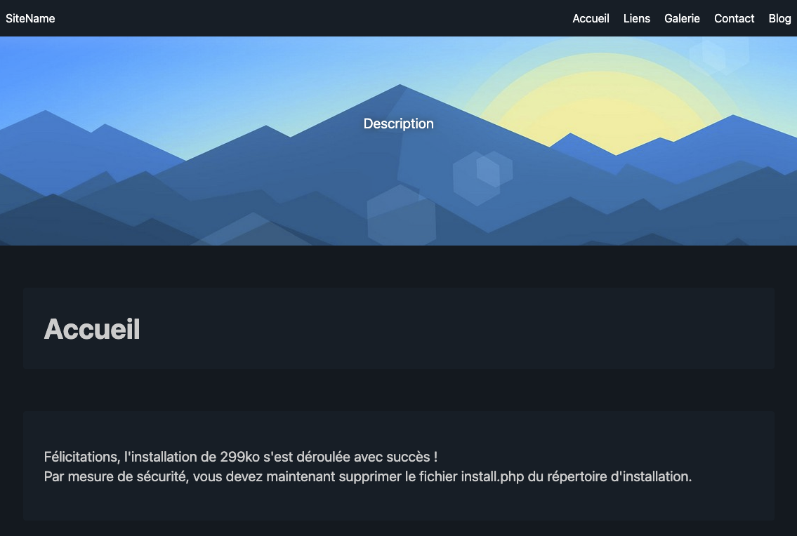

<!--
Важно: этот README был автоматически сгенерирован <https://github.com/YunoHost/apps/tree/master/tools/readme_generator>
Он НЕ ДОЛЖЕН редактироваться вручную.
-->

# 299Ko для YunoHost

[](https://ci-apps.yunohost.org/ci/apps/299ko/)


[](https://install-app.yunohost.org/?app=299ko)

*[Прочтите этот README на других языках.](./ALL_README.md)*

> *Этот пакет позволяет Вам установить 299Ko быстро и просто на YunoHost-сервер.*  
> *Если у Вас нет YunoHost, пожалуйста, посмотрите [инструкцию](https://yunohost.org/install), чтобы узнать, как установить его.*

## Обзор

299Ko est un CMS (système de gestion de contenu) français, léger et rapide, écrit en PHP.
Inspiré du CMS 99ko, il conserve une philosophie axée sur la simplicité et la facilité d'utilisation. Ce logiciel libre, sous licence GNU GPL v3, est entièrement gratuit et permet à quiconque de créer son propre site internet, blog, galerie d'images, et bien plus encore, sans nécessiter de connaissances en programmation.

**Поставляемая версия:** 2.0.0~ynh1

## Снимки экрана



## Документация и ресурсы

- Официальный веб-сайт приложения: <https://299ko.ovh/>
- Официальная документация администратора: <https://docs.299ko.ovh/francais>
- Репозиторий кода главной ветки приложения: <https://github.com/299Ko/299ko>
- Магазин YunoHost: <https://apps.yunohost.org/app/299ko>
- Сообщите об ошибке: <https://github.com/YunoHost-Apps/299ko_ynh/issues>

## Информация для разработчиков

Пришлите Ваш запрос на слияние в [ветку `testing`](https://github.com/YunoHost-Apps/299ko_ynh/tree/testing).

Чтобы попробовать ветку `testing`, пожалуйста, сделайте что-то вроде этого:

```bash
sudo yunohost app install https://github.com/YunoHost-Apps/299ko_ynh/tree/testing --debug
или
sudo yunohost app upgrade 299ko -u https://github.com/YunoHost-Apps/299ko_ynh/tree/testing --debug
```

**Больше информации о пакетировании приложений:** <https://yunohost.org/packaging_apps>
